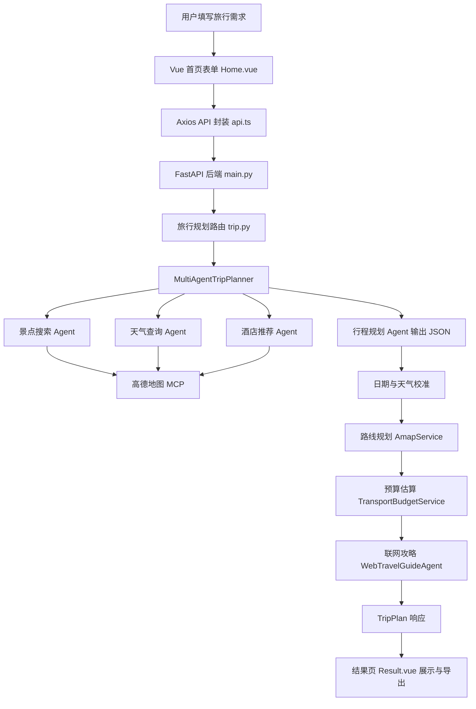

# 项目大作业报告：灵途 AI 旅行规划师

课程名称：填写你的课程名  
项目名称：灵途 AI 旅行规划师  
项目类型：Web应用  
报告语言：中文  

## 摘要

本项目“灵途 AI 旅行规划师”是一个面向个性化旅行规划场景的前后端分离 Web 应用。项目以 FastAPI 作为后端服务框架，以 Vue 3、TypeScript、Vite 和 Ant Design Vue 构建前端交互界面，并结合 HelloAgents 智能体框架、高德地图 MCP 服务、火山引擎联网问答 Agent、FlyAI 预算数据源等外部能力，实现目的地推荐、旅行计划生成、景点与天气查询、路线规划、预算估算、联网行前攻略和结果导出等功能。

从项目文件看，后端核心逻辑集中在 `backend/app/agents/trip_planner_agent.py`、`backend/app/services/amap_service.py`、`backend/app/services/transport_budget_service.py` 和 `backend/app/agents/web_travel_guide_agent.py`。前端核心界面集中在 `frontend/src/views/Home.vue` 和 `frontend/src/views/Result.vue`。项目具备较完整的工程结构和功能闭环，但也存在自动化测试不足、外部服务依赖较强、提交记录为空等问题。本报告基于当前目录中的 README、源码、配置、运行脚本、日志和基础检查结果撰写。

## 1. 项目背景与意义

随着在线旅游平台和地图服务的发展，用户可以获得大量景点、酒店、交通和天气信息。但这些信息通常分散在不同平台，用户需要自行筛选、组合和判断，尤其是在多日旅行规划场景中，常见问题包括景点顺序不合理、路线衔接困难、预算估算粗略、天气和预约信息容易遗漏等。

本项目希望通过智能体协作和地图服务集成，将“输入旅行需求”到“生成可执行行程”的过程自动化。用户只需提供出发城市、目的地、日期、天数、预算、人数、交通方式、住宿偏好和旅行偏好，系统即可生成结构化旅行计划，并在结果页展示每日行程、景点地图、路线、天气、预算、联网攻略和审核建议。

本项目的学习价值主要体现在三个方面：第一，实践了前后端分离 Web 应用的完整开发流程；第二，探索了大语言模型与外部工具调用结合的智能体应用模式；第三，将地图、天气、路线、预算、联网检索等多源信息整合到统一的数据模型中，具有较强的工程综合性。

## 2. 项目目标与需求分析

项目目录中未发现独立的课程作业要求文件，`report_prompt.md` 与本次报告任务要求一致；因此本报告按常见课程大作业报告格式进行总结。

本项目的总体目标是构建一个智能旅行规划系统，使用户能够通过 Web 页面完成旅行需求填写、目的地推荐、行程生成和结果查看。

功能需求包括：

1. 用户能够填写旅行基础信息，包括出发城市、目的地城市、开始日期、结束日期、旅行天数、出行人数、预算、交通方式、城际交通方式、住宿偏好和旅行偏好。
2. 当用户不知道去哪旅行时，系统能够通过目的地推荐助手推荐 1 至 3 个候选城市，并支持一键回填表单。
3. 系统能够根据用户需求生成多日旅行计划，每日包含行程描述、交通方式、住宿、景点、餐饮和路线信息。
4. 系统能够调用高德地图相关能力，完成 POI 搜索、天气查询、地址解析和路线规划。
5. 系统能够生成预算估算，覆盖景点门票、酒店、餐饮、市内交通和城际交通。
6. 系统能够输出联网行前攻略，并对攻略内容进行审核，提示引用来源、缺失项和复核建议。
7. 前端结果页能够展示地图、景点、路线、天气、预算、联网攻略，并支持编辑行程和导出图片/PDF。

非功能需求包括：

1. 配置应通过环境变量管理，避免将敏感密钥写死在代码中。
2. 后端接口应有清晰的数据模型和错误处理。
3. 外部服务不可用时应尽量降级，而不是直接中断整个流程。
4. 前端应具有较好的响应式布局和用户交互反馈。
5. 系统应具备一定可扩展性，便于后续增加数据源、Agent 或功能模块。

从当前代码完成度看，主要功能模块已经实现，前端也已有构建产物 `frontend/dist/index.html`。但根据项目文件无法确认完整线上部署效果，也未发现自动化测试目录或测试用例。

## 3. 技术选型与开发环境

后端使用 Python，主要依赖见 `backend/requirements.txt`，包括 `fastapi`、`uvicorn`、`pydantic`、`pydantic-settings`、`httpx`、`aiohttp`、`python-dotenv`、`loguru`、`fastmcp`、`uv` 和 `hello-agents[protocols]`。其中 FastAPI 适合构建类型明确、自动生成文档的 REST API；Pydantic 适合定义旅行计划这种结构化数据；HelloAgents 用于封装智能体与工具调用；httpx 用于调用高德地图 Web Service 和火山引擎接口。

前端使用 Vue 3、TypeScript、Vite、Ant Design Vue、Axios、高德地图 JS API、html2canvas 和 jsPDF，依赖见 `frontend/package.json`。Vue 3 和 TypeScript 有利于构建复杂表单与结果展示页，Ant Design Vue 提供表单、卡片、折叠面板、菜单、提示等组件，Axios 用于统一封装 API 请求，html2canvas 和 jsPDF 支持行程结果导出。

配置管理由 `backend/app/config.py` 负责。该文件通过 `.env` 和 `.env.example` 读取应用名称、端口、CORS、高德地图 API Key、LLM 配置、Unsplash 配置、FlyAI 配置和火山引擎配置。前端通过 `frontend/.env.example` 配置 `VITE_API_BASE_URL`、`VITE_AMAP_WEB_JS_KEY` 和高德地图安全密钥等变量。正式提交时应确认示例配置中不包含真实密钥。

运行方式如下：

```bash
# 后端
cd backend
uvicorn app.api.main:app --reload --host 0.0.0.0 --port 8000

# 或使用脚本
python backend/run.py

# 前端
cd frontend
npm install
npm run dev
```

`backend/run_jupyter.ps1` 还提供了面向本地 Conda/Jupyter 环境的启动方式，默认解释器路径为 `D:\conda_envs\jupyter\python.exe`。

## 4. 系统总体设计

系统采用前后端分离架构。前端负责表单输入、推荐助手、结果展示、地图渲染、编辑和导出；后端负责智能体编排、地图服务调用、预算估算、联网攻略生成和 API 响应。

后端入口文件为 `backend/app/api/main.py`，其中创建 FastAPI 应用，配置 CORS，并挂载 `trip`、`poi`、`recommend`、`map` 四类路由。核心数据模型定义在 `backend/app/models/schemas.py`，包括 `TripRequest`、`TripPlan`、`DayPlan`、`Attraction`、`RouteSegment`、`Budget`、`AgentAuditResult` 等。

系统流程如下：



系统没有使用数据库，行程结果主要由后端生成后返回前端，前端将结果存入 `sessionStorage`，供 `Result.vue` 页面读取和展示。这种方式实现简单，适合课程项目和单用户演示，但不适合长期保存、多设备同步或多人协作。

## 5. 核心功能与实现

### 5.1 旅行需求建模与 API 层

功能作用：统一定义前后端传输的数据结构，并提供 HTTP 接口。

关键实现思路：`backend/app/models/schemas.py` 使用 Pydantic 定义请求和响应模型。例如 `TripRequest` 定义旅行规划输入，包含 `origin_city`、`city`、`start_date`、`end_date`、`travel_days`、`travelers`、`budget`、`transportation`、`accommodation` 和 `preferences`。`TripPlan` 则定义完整结果，包括每日行程、天气、预算、联网攻略、引用来源和审核结果。

涉及文件包括 `backend/app/api/main.py`、`backend/app/api/routes/trip.py`、`backend/app/api/routes/map.py`、`backend/app/api/routes/poi.py`、`backend/app/api/routes/recommend.py` 和 `backend/app/models/schemas.py`。这些路由与服务层解耦，API 层主要负责接收请求、调用 Agent 或服务、返回结构化响应。

### 5.2 多智能体旅行规划

功能作用：根据用户需求生成多日旅行计划。

关键实现思路：`backend/app/agents/trip_planner_agent.py` 定义 `MultiAgentTripPlanner`。该类在初始化时创建景点搜索 Agent、天气查询 Agent、酒店推荐 Agent 和行程规划 Agent。前三个 Agent 通过共享的 `MCPTool` 调用高德地图工具，行程规划 Agent 负责整合景点、天气和酒店信息，并按提示词要求输出 JSON。

`plan_trip()` 方法体现了主流程：先构造景点查询，再查询天气和酒店，随后构建规划提示词，解析模型返回的 JSON，最后进行日期校准、路线规划、预算估算和联网攻略补充。若任一步骤失败，系统会调用 `_create_fallback_plan()` 生成备用计划。

该模块与 `llm_service.py`、`amap_service.py`、`transport_budget_service.py` 和 `web_travel_guide_agent.py` 关系紧密，是整个后端的调度中心。

### 5.3 高德地图服务封装

功能作用：为 POI 搜索、天气查询、地理编码和路线规划提供统一接口。

关键实现思路：`backend/app/services/amap_service.py` 封装 `AmapService`。其中 `search_poi()` 和 `get_weather()` 通过高德地图 MCP 工具调用 `maps_text_search` 和 `maps_weather`；`plan_route()` 则先调用高德地理编码接口将地址转为经纬度，再调用步行、驾车或公交路线 API。

该文件还实现了 `_extract_json_data()`、`_find_list_by_key()`、`_parse_location()` 等辅助函数，用于处理 MCP 返回值可能是字符串、字典、列表或代码块文本的情况，提高了对外部工具返回格式的容错能力。

### 5.4 预算估算模块

功能作用：估算旅行总成本，为用户提供预算参考。

关键实现思路：`backend/app/services/transport_budget_service.py` 定义 `TransportBudgetService`。该模块优先通过 FlyAI CLI 查询酒店、航班或火车价格；如果 FlyAI 不可用或未返回有效数据，则使用规则估算。酒店价格会根据住宿类型映射为经济型、舒适型、豪华酒店或民宿的参考单价；市内交通根据公共交通、步行、自驾、混合方式估算；餐饮费用在缺少结构化价格时按天数、人数和住宿档次估算。

最终预算结果写入 `Budget` 模型，包括 `total_attractions`、`total_hotels`、`total_meals`、`total_transportation`、`total`、`budget_source` 和 `budget_notes`。该模块的优点是既能利用外部实时数据，也能在数据源不可用时保持结果完整。

### 5.5 联网攻略与审核模块

功能作用：对生成的旅行计划进行行前攻略补充，并标注审核状态。

关键实现思路：`backend/app/agents/web_travel_guide_agent.py` 定义 `WebTravelGuideAgent`。它通过 `backend/app/services/volcengine_agent_service.py` 调用火山引擎联网问答 Agent，要求联网核对预约、天气、票务、交通、酒店和预算。如果火山引擎凭证未配置或调用失败，则生成本地降级攻略。

该模块还实现 `audit_guide()`，检查攻略是否包含行前准备、预约要求、穿衣建议、物品准备、行程总览、核心景点、跨市交通、入住酒店、总预算等栏目，并判断是否缺少引用来源、日期或城市信息。审核结果通过 `AgentAuditResult` 返回前端。

### 5.6 目的地推荐助手

功能作用：当用户没有明确目的地时，根据预算、天数和偏好推荐城市。

关键实现思路：`backend/app/agents/destination_recommender_agent.py` 定义 `DestinationRecommenderAgent`。它优先尝试使用 LLM 生成候选城市；若 LLM 初始化失败或输出无法解析，则使用内置规则和城市画像。规则中包含南京、成都、杭州、西安、厦门、长沙、苏州、桂林、上海等城市的偏好标签和代表景点，并根据出发城市匹配周边城市。

推荐结果会通过 `RecommendationFormPatch` 返回前端，用户点击“选这个”后，`Home.vue` 会将城市、天数、预算、交通、住宿、偏好和额外要求回填到表单中。

### 5.7 前端交互与结果展示

功能作用：提供用户输入、结果查看、地图展示、编辑和导出功能。

关键实现思路：`frontend/src/views/Home.vue` 实现首页表单和目的地推荐助手。表单使用 Ant Design Vue 组件，监听开始日期和结束日期自动计算旅行天数，并通过 `generateTripPlan()` 调用后端。生成成功后，结果保存到 `sessionStorage`，页面跳转至 `/result`。

`frontend/src/views/Result.vue` 实现结果页。它读取 `sessionStorage` 中的 `tripPlan`，展示行程概览、每日行程、景点卡片、路线规划、酒店、餐饮、天气、联网攻略、资料来源和审核检查。该页面还使用高德地图 JS API 加载地图并添加景点标记与路线折线，支持编辑景点顺序、删除景点、保存修改，以及通过 `html2canvas` 和 `jsPDF` 导出图片或 PDF。

## 6. 关键技术难点与解决方案

第一个难点是大语言模型输出的不确定性。旅行规划 Agent 要求输出严格 JSON，但模型可能返回 Markdown 代码块、普通文本或格式不完整内容。项目在 `_parse_response()` 中按 ` ```json `、普通代码块和首尾大括号三种情况提取 JSON，并在失败时调用备用计划生成函数。这样可以减少单次模型异常对整体流程的影响。

第二个难点是天气日期对齐。高德天气接口通常只能返回近期预报，而用户可能规划较远日期。项目在 `_normalize_plan_dates_and_weather()` 中对旅行日期和天气日期进行校验，只有天气源覆盖旅行日期或行程处于近期预报窗口时才保留天气信息，否则清空 `weather_info` 并在 `overall_suggestions` 中提示出发前复核天气。这避免了把近期天气错误改写成未来旅行日期。

第三个难点是外部服务依赖复杂。项目依赖 LLM、高德地图、FlyAI、火山引擎、Unsplash 等服务，任何一个服务缺少密钥或网络异常都可能失败。项目通过 `config.py` 集中管理配置，通过 `validate_config()` 校验高德地图 Key，通过服务层捕获异常并返回空结果或降级文本，从而提高系统鲁棒性。

第四个难点是路线规划需要先解析地址。`AmapService.plan_route()` 先通过高德地理编码接口将起终点地址转换为经纬度，再调用不同路线 API。`trip_planner_agent.py` 还通过 `amap_route_max_segments` 限制路线规划段数，通过 `amap_route_timeout` 控制超时，避免多日行程中大量路线请求导致响应过慢。

第五个难点是前端结果内容复杂。`Result.vue` 需要同时展示地图、景点、路线、预算、天气、联网攻略和审核结果，并支持编辑和导出。项目通过 TypeScript 类型定义保证数据结构一致，通过 `normalizeTripPlan()` 对后端返回数据做防御式处理，通过自定义 Markdown 渲染函数对联网攻略进行转义和格式化，降低了前端渲染异常风险。

## 7. 测试、运行与结果分析

本次检查未发现独立测试目录或自动化测试文件。根据任务限制，本次没有强制完整运行外部依赖服务，但进行了基础静态和导入检查。

已执行的验证包括：

```bash
npx vue-tsc --noEmit
```

该命令无错误输出，说明前端 TypeScript 类型检查通过。

```bash
npm run build
```

该命令在 `vue-tsc` 后进入 Vite 构建阶段失败，错误为 `Error: spawn EPERM`，发生在 Vite 调用 esbuild 子进程加载 `vite.config.ts` 时。该问题更像当前沙箱对子进程启动的权限限制，而不是业务代码类型错误。项目目录中已存在 `frontend/dist/index.html`，说明此前至少生成过前端构建产物。

后端使用本地 Jupyter Conda 环境解释器进行了语法检查：

```bash
D:\conda_envs\jupyter\python.exe -m compileall -q E:\agent\agent1\backend\app
```

该命令执行成功，无错误输出。随后导入 FastAPI 应用：

```bash
D:\conda_envs\jupyter\python.exe -c "import sys; sys.path.insert(0, r'E:\agent\agent1\backend'); import app.api.main as m; print(m.app.title); print(len(m.app.routes))"
```

输出显示应用标题为“灵途 AI 旅行规划师”，注册路由数量为 16，说明后端应用可以被解释器导入。

尝试使用 `conda run -p D:\conda_envs\jupyter` 执行时，遇到临时文件占用错误；`conda env list` 也受到 Conda 插件和权限问题影响。因此完整运行验证未通过 `conda run` 完成，而是使用明确的 Conda 环境 Python 路径进行了只读检查。

已有日志文件显示后端曾启动并通过配置校验，同时也记录过端口占用问题。由于完整生成旅行计划需要高德地图、LLM、MCP、FlyAI、火山引擎等外部服务和有效密钥，本报告不编造端到端运行结果。根据项目文件无法确认真实用户请求下的最终生成质量和耗时表现。

## 8. 项目创新点与特色

第一，项目不是简单调用一次大模型生成文本，而是将旅行规划拆分为景点搜索、天气查询、酒店推荐、行程整合、路线规划、预算估算和联网攻略审核多个环节，体现了多智能体协作思想。

第二，项目将高德地图 MCP 工具和高德 Web Service 结合使用。MCP 用于 POI 和天气等工具调用，REST API 用于地理编码和路线规划，两种方式互补，提升了地图能力的覆盖范围。

第三，项目对外部服务失败设计了降级策略。LLM 规划失败时有备用行程，FlyAI 不可用时有规则预算估算，火山联网 Agent 不可用时有本地行前攻略，Unsplash 未配置时跳过图片搜索。这种设计使系统更适合实际演示和教学场景。

第四，前端结果页功能较完整，不仅展示行程，还支持地图标记、路线折线、行程编辑、图片/PDF 导出、联网资料来源和审核检查，形成了从输入到交付的闭环。

第五，项目对天气日期、联网攻略日期和审核内容进行了显式校验，避免常见的“看似完整但事实不可靠”的生成式应用问题。

## 9. 不足与改进方向

第一，项目缺少自动化测试。当前没有发现单元测试、接口测试或端到端测试文件。后续应为 `AmapService`、`TransportBudgetService`、`WebTravelGuideAgent` 和 API 路由添加测试，尤其要覆盖外部服务失败、JSON 解析失败、天气日期不匹配等情况。

第二，项目高度依赖外部服务和密钥。高德地图、LLM、FlyAI、火山引擎、Unsplash 都需要配置，完整运行门槛较高。后续可以增加 Mock 模式或离线演示数据，便于课程答辩和无网络环境展示。

第三，备用行程仍偏简单。`_create_fallback_plan()` 会生成占位景点和模拟坐标，这能保证响应结构完整，但不适合作为真实旅行建议。后续可基于本地城市景点库或高德 POI 缓存优化备用方案。

第四，项目没有数据库。当前结果保存在浏览器 `sessionStorage` 中，刷新或跨设备使用时存在限制。后续可以增加用户、行程、收藏和历史记录表，实现长期保存和二次编辑。

第五，Git 仓库当前没有提交记录，`git log` 显示 master 分支尚无提交，所有项目文件为未跟踪状态。这不利于展示项目演进过程和协作开发过程。后续应规范提交历史，并添加 `.gitignore` 排除 `.chrome-map-test`、日志、缓存和真实 `.env` 文件。

第六，前端 `.env.example` 中出现了看似真实的高德地图 Key。虽然这是示例文件，但正式提交或开源时应替换为占位值，避免密钥泄露风险。

## 10. 总结

本项目完成了一个较完整的智能旅行规划 Web 应用。项目围绕旅行规划这一实际场景，将前端表单交互、后端 API、智能体协作、地图服务、路线规划、预算估算、联网攻略和结果导出进行了综合集成。后端使用 FastAPI 和 Pydantic 保证接口结构清晰，使用 HelloAgents 和 MCPTool 实现工具型 Agent 调用；前端使用 Vue 3 和 TypeScript 构建交互界面，能够完成输入、推荐、展示、编辑和导出。

通过本项目，可以较系统地理解课程中涉及的 Web 开发、接口设计、模块化工程、外部 API 调用、异常处理和智能体应用设计等内容。项目目前已经具备课程大作业展示价值，但在自动化测试、部署稳定性、数据持久化、安全配置和真实运行验证方面仍有改进空间。

## 参考文献

1. FastAPI 官方文档：https://fastapi.tiangolo.com/
2. Vue.js 官方文档：https://vuejs.org/
3. Vite 官方文档：https://vite.dev/
4. Ant Design Vue 官方文档：https://antdv.com/
5. Pydantic 官方文档：https://docs.pydantic.dev/
6. Axios 官方文档：https://axios-http.com/
7. 高德开放平台文档：https://lbs.amap.com/
8. HelloAgents 项目：https://github.com/datawhalechina/Hello-Agents
9. amap-mcp-server 项目：https://github.com/sugarforever/amap-mcp-server
10. 火山引擎联网问答 Agent 文档：https://www.volcengine.com/docs/85508/1510834
11. html2canvas 文档：https://html2canvas.hertzen.com/
12. jsPDF 文档：https://github.com/parallax/jsPDF

## 答辩陈述稿

各位老师好，我本次大作业完成的项目是“灵途 AI 旅行规划师”，它是一个前后端分离的智能旅行规划 Web 应用。项目的目标是解决用户在旅行前需要反复查询景点、天气、路线、住宿和预算的问题，让用户输入目的地、日期、预算、人数和偏好后，系统自动生成一份结构化、多日可执行的旅行计划。

在技术实现上，我使用 Vue 3、TypeScript、Vite 和 Ant Design Vue 构建前端页面，主要包括首页表单、目的地推荐助手和结果展示页。后端使用 FastAPI 和 Pydantic 设计接口和数据模型，并使用 HelloAgents 构建多智能体流程。系统中有景点搜索 Agent、天气查询 Agent、酒店推荐 Agent 和行程规划 Agent，它们通过高德地图 MCP 工具获取 POI 和天气信息，再由规划 Agent 整合成 JSON 格式的旅行计划。

除了基础行程生成，我还实现了路线规划、预算估算和联网攻略审核。路线规划通过高德地图地址解析和路线接口完成；预算模块优先使用 FlyAI 查询酒店和交通价格，失败时使用规则估算；联网攻略模块通过火山引擎 Agent 核对预约、天气、票务和注意事项，如果没有配置凭证，也会生成本地降级攻略并提示需要人工复核。前端结果页支持地图标记、路线显示、编辑行程，以及导出图片和 PDF。

本项目目前已经完成主要功能闭环，后端语法检查和应用导入检查通过，前端 TypeScript 检查也通过。但项目仍存在不足，例如缺少自动化测试、完整运行依赖外部 API 密钥、没有数据库持久化，以及 Git 提交记录还不规范。通过这个项目，我加深了对 Web 应用架构、API 设计、智能体工具调用、异常降级和前后端数据协作的理解，也认识到真实工程中稳定性、测试和配置安全同样重要。